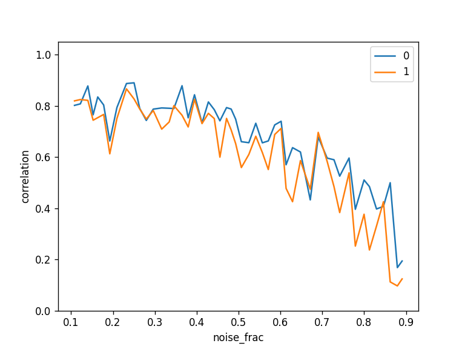
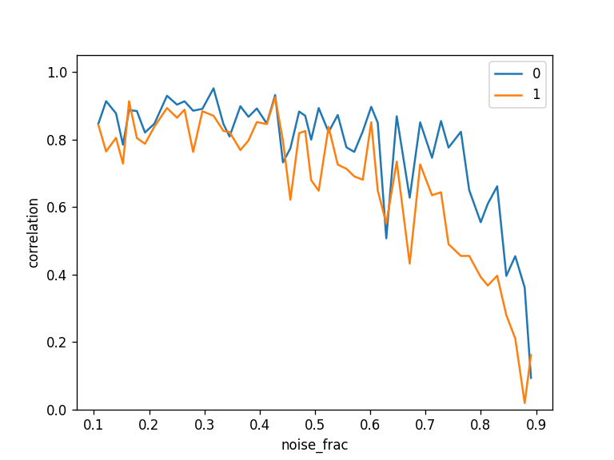
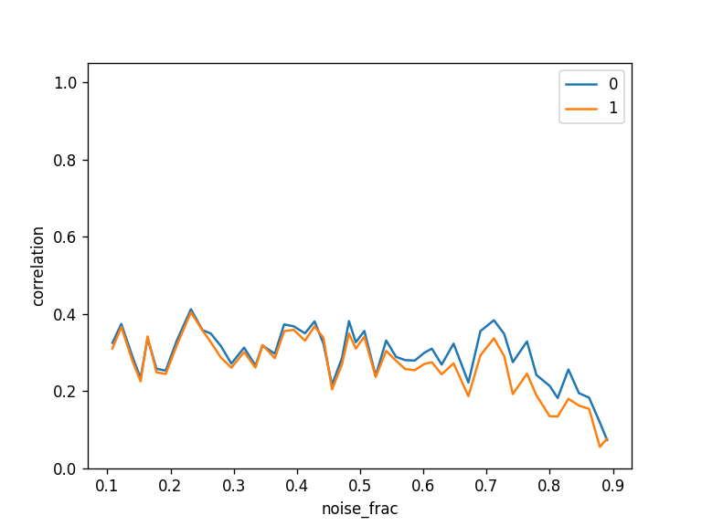

# Precision nudging with Machine Learning

<!-- TABLE OF CONTENTS -->
## Table of Contents
- [About the Project](#about-the-project)
   - [Combining Data](#combining-data)
   - [Probabilistic Model](#probabilistic-model)
   - [Simulations](#simulations)
- [Getting Started](#getting-started)
   - [Prerequisites](#prerequisites)
   - [Installation](#installation)
   - [Testing](#testing)
- [Usage](#usage)
   - [Get Data](#get-data)
   - [Prepare](#prepare)
   - [Train](#train)
   - [Evaluate](#evaluate)
   - [Predict](#predict)
- [Contributing](#contributing)
- [Contact](#contact)

## About the Project
This software package is under development within the Precision Nudging project. The scientific aim of this project is to use open data to develop predictive models with Machine Learning, in order to determine the most effective nudge for persons, given the nudging goal and the individual personal circumstances. 

Thus, we are interested in the heterogeneous treatment effect of nudges. Conventionally, heterogeneous treatment effects are found by dividing the study data into subgroups (e.g., men and women, or by age) and compare the conditional average treatment effect (CATE) between subgroups. A challenge with this approach is that each subgroup may have substantially less data than the study as a whole, and there may not be enough data to accurately estimate the effects on subgroups. Recently and increasingly, however, machine learning is used to estimate heterogeneous treatment effects, even on the level of individuals, see e.g. [Künzel et al. 2019](https://www.pnas.org/content/116/10/4156).

Most nudging research uses standard social science techniques like field experiments, surveys, or document analyses. Using Machine Learning combined with open data can help us discover new ways to apply behavior change techniques to solve societal problems. We focus on improving health behavior, such as eating and exercising, as unhealthy behavior is a crucial societal problem. We use open data from published nudging studies to train our model. 

The project can be split in several steps: 
1) We combine open data from different, published studies. 
2) We train a machine learning model on the combined dataset to determine the most effective nudge per subject group.
3) We simulate datasets to test the model and compare against other methods.

In the sections below, we elaborate on these steps.

### Combining Data

One of the main challenges is how to combine data from the widely varying studies. Each study has measured a different outcome variable to determine the effectiveness of a nudge. Furthermore, in some studies, the effectiveness of a nudge is determined through an observational (non-randomized) study and not a randomized controlled trial. In an observational study, the treatment and control (untreated) groups are not directly comparable, because they may systematically differ at baseline. Here, we propose to use propensity score matching to tackle these issue (see e.g. [Austin 2011](https://www.ncbi.nlm.nih.gov/pmc/articles/PMC3144483/)).

The propensity score is the probability of treatment assignment, given observed baseline characteristics. The propensity score can be used to balance the treatment and control groups to make them comparable. [Rosenbaum and Rubin (1983)](https://academic.oup.com/biomet/article/70/1/41/240879) showed that treated and untreated subjects with the same propensity scores have identical distributions for all baseline variables. Thus, the propensity score allows one to analyze an observational study as if it were a randomized controlled trial. In our case, the treatment group is the group that received a nudge and the control is the group that didn't. The observed baseline characteristics are specified per study, and typically include age and gender of the subject.

For each study separately, we estimate the propensity score by logistic regression. This is a statistical model used to predict the probability that an event occurs. In logistic regression, the dependent variable is binary; in our case, we have Z=1 for the treated subjects and Z=0 for the untreated subjects. We can then derive the logistic regression model and subsequently use it to calculate the propensity score for each subject. Propensity score matching is done by nearest neighbour matching of treated and untreated subjects, so that matched subjects have similar values of the propensity score.

When we have matched subjects, we simply determine the nudge succes by evaluating whether the outcome variable had increased or decreased, depending on the nudge study. Thus nudge success is a binary, 0 for failure or 1 for success, which allows us to combine the results for different studies.

Finally, we record for each subject in the treatment group the following:
- age
- gender (0=female, 1=male)
- other relevant personal characteristics
- nudge success (0=failure, 1=success)
- nudge domain
- nudge type

Note that the nudge domain and nudge type can differ per study. We distinguish the following categories in this study:

**Nudge types** (see [Sunstein (2014)](https://link.springer.com/article/10.1007/s10603-014-9273-1)):
1. Default. For instance automatic enrolment in programs 
2. Simplification 
3. Social norms 
4. Change effort 
5. Disclosure 
6. Warnings, graphics. Think of cigarettes. 
7. Precommitment 
8. Reminders 
9. Eliciting implementation intentions 
10. Feedback: Informing people of the nature and consequences of their own past choices 

**Nudge domains** (see [Hummel and Maedche (2019)](https://ideas.repec.org/a/eee/soceco/v80y2019icp47-58.html)):
1. Energy consumption 
2. Healthy products 
3. Environmentally friendly products 
4. Amount donated 

### Probabilistic Model
Once, we have combined the data from different studies, we can determine which nudge type is most effective for a certain group of people, for a given nudge domain. We use age and gender to divide people into subgroups, although we could easily include more observed characteristics if these are available. We use a probabilistic classifier to determine the most effective nudge, which has the advantage that we can also rank nudges on effectiveness instead of selecting only the most effective one. Nudge effectiveness is defined as the probability of nudge success.

We implemented both a logistic regression and a naive Bayes classifier using [scikit-learn](https://scikit-learn.org). Logistic regression is a discriminitive model, meaning it learns the posterior probability directly from the tranining data. Naive Bayes is a generative model, meaning it learns the joint probability distribution and uses Bayes' Theorem to predicts the posterior probability. Typically, naive Bayes converges quicker but has a higher error than logistic regression, see [Ng and Jordan 2001](https://dl.acm.org/doi/10.5555/2980539.2980648). Thus, while on small datasets naive Bayes may be preferable, logistic regression is likely to achieve better results as the training set size grows.

### Simulations
We generated 1000 datasets with varying control parameters such as noise, number of subjects, etc. as described [here](nudging/simulation/README.md). Each dataset consists of half treatment group (nudged) and half control group (non-nudged). For each dataset we determine the nudge effectiveness as described above. We then compute the correlation between nudge effectiveness and the CATE. If the correlation is good, we may assume that the nudge effectivenes is a good proxy for the CATE. Note that our goal is not to predict the CATE but to find a proxy of the VATE that we use on combined studies/datasets with different outcome variables.

For the simulated datasets, we know the CATE that was used as model input, we call this cate_model. We can also derive the "observed" VATE (cate_obs) per subgroup by mean(treatment) - mean(control). While cate_model is known both for individuals and subgroups, cate_obs can only be derived for subgroups. We show the correlation for all three types of CATEs.

Except for the method as described above (based on propensity score matching per dataset and determining nudge effectiveness), we also apply a regressor model that predicts the outcome and CATE directly, as described [here](nudging/model/README.md). We expect the regressor model to be more accurate in predicting the outcome/CATE within one dataset, in particular when there are many covariates. However, it has the limitation that it can only be applied to combined studies if the outcome variables are standardized. How to standardize the data for this use may be a topic for future investigation. In the meantime, we can use the regressor model to compare the probabilistic model against.

For the below plots, regressor model=0 (blue) and probablistic model=1 (orange).

#### Correlation with cate_obs for subgroups:

#### Correlation with cate_model for subgroups:

#### Correlation with cate_model for individuals:

## Getting Started

### Prerequisites
This project makes use of Python 3.9.2 and [Poetry](https://python-poetry.org/) for managing dependencies. 

### Installation
You can simply install the dependencies with 
`poetry install` in the projects root folder.

### Testing
The test are located in the `tests` folder. To run the tests execute:
`poetry run pytest tests`

Note that the `poetry run` command executes the given command inside the project’s virtual environment.

## Usage
The data processing pipeline consists of several stages which we describe below.

### Get Data
The data used in this project is under [DVC](https://dvc.org/) version control. To get access to the data contact one of the repo contributors. The following assumes that the external data has been downloaded. To check the downloaded data:

`poetry run python nudging/check_data.py`

This should give a summary of the datasets stored in `data/external`.

### Prepare
Calculate nudge succes per subject with:

`poetry run python nudging/prepare.py`

This generates a csv file for each study in `data/interim` and a combined csv file `data/interim/combined.csv`. Each row represents a subject and contains personal characteristics (covariates) and nudge success calculated using propensity score matching. The covariates used for propensity score matching are defined per dataset/study separately.

### Train
First, choose the features to be used for training through the configuration file `config.yaml`. Only datasets containing all features will be used. By default, we use:
- nudge_domain
- nudge_type
- gender
- age

Train a probabilistic classifier on the combined dataset:

`poetry run python nudging/train.py`

By default logistic regression is used, but you can also select naive Bayes with:

`poetry run python nudging/train.py naive_bayes`

The trained model is written to `models/nudging.joblib`.

### Evaluate
Evaluate the trained model using the combined dataset:

`poetry run python nudging/evaluate.py`

 Note that we have not (yet) split off the dataset for training and evaluation. This means we apply the model on the same dataset we trained on. The computed probability is rounded to 0 or 1 and compared to the nudge success. TO DO: evaluate on unused data.

### Predict
Predict nudge effectiveness using the trained model:

`poetry run python nudging/predict.py`

The predicted nudge effectiveness per subgroup is written to `data/processed/nudge_probability.csv`. Also, plots of the nudge effectiveness are generated and stored in the `plots` folder.

<!-- CONTRIBUTING -->
## Contributing

Contributions are what make the open source community an amazing place to learn, inspire, and create. Any contributions you make are **greatly appreciated**.

To contribute:

1. Fork the Project
2. Create your Feature Branch (`git checkout -b feature/AmazingFeature`)
3. Commit your Changes (`git commit -m 'Add some AmazingFeature'`)
4. Push to the Branch (`git push origin feature/AmazingFeature`)
5. Open a Pull Request

<!-- CONTACT -->
## Contact
[UU Research Engineering team](https://github.com/orgs/UtrechtUniversity/teams/research-engineering) - research.engineering@uu.nl
